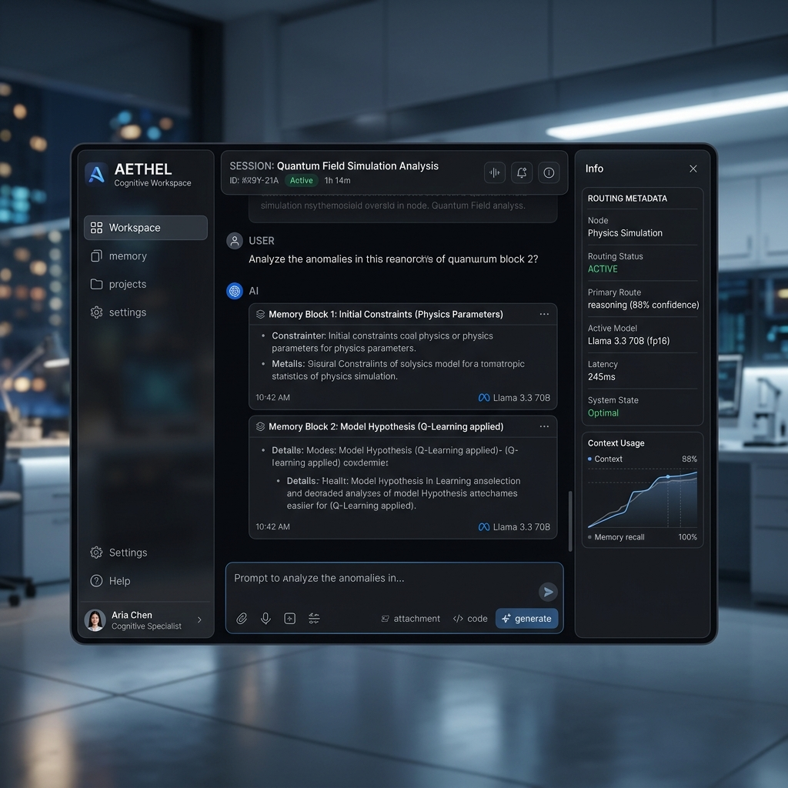

# APJ-AI: A Cognitive Workspace 🧠

[](https://www.python.org/downloads/release/python-390/)
[](https://fastapi.tiangolo.com/)
[](https://flask.palletsprojects.com/)
[](https://qdrant.tech/)

APJ-AI is a premium, cinematic cognitive operating system designed for deep conversation analysis and hierarchical RAG. It features a triple-tier memory architecture that solves context fragmentation and model hallucinations in local LLM deployments.



## 🚀 Key Features
- **Hierarchical Memory**: 3-tier system (Short-term, Mid-term snapshots, Long-term semantic tiles).
- **Intelligent Routing**: Automatic task classification (Coding, Research, Reasoning, Chat).
- **Hybrid Intelligence**: Seamlessly switches between local Qwen-3B and cloud models (Gemini/Groq).
- **Zero-Hallucination Engineering**: Nuclear grounding with evidence-linking and identity isolation.
- **Premium UI**: Dark-themed, responsive interface with real-time routing metadata and syntax highlighting.

## 🧠 Architecture
1. **Frontend (Flask)**: High-fidelity UI with real-time stats and Markdown rendering.
2. **Backend (FastAPI)**: Async orchestration layer for routing, memory, and model inference.
3. **Memory (Qdrant)**: Local vector database for semantic retrieval.
4. **Reasoning**: Hybrid cloud/local execution with automatic fallback.

## 🛠️ Setup Guide

### 1. Prerequisites
- Python 3.9+
- [C++ Redistributables](https://aka.ms/vs/17/release/vc_redist.x64.exe) (for llama-cpp-python)

### 2. Installation
```bash
# Clone the repository
git clone https://github.com/navonilmandal/APJ-AI-A-Cognitive-Workspace.git
cd APJ-AI-A-Cognitive-Workspace

# Create virtual environment
python -m venv venv
source venv/bin/scripts/activate  # On Windows: venv\Scripts\activate

# Install dependencies
pip install -r requirements.txt
pip install -r frontend/requirements.txt
```

### 3. Configuration
Create a `.env` file in the root directory:
```env
PROJECT_ROOT=E:/ai_ml_intern
GEMINI_API_KEY=your_key
GROQ_API_KEY=your_key
OPENROUTER_API_KEY=your_key
```

### 4. Running the System
**Start Backend:**
```bash
python -m backend.main
```
**Start Frontend:**
```bash
python frontend/app.py
```
Open `http://127.0.0.1:5000` in your browser.

## 🏗️ Technical Roadmap
- [ ] **BM25 Hybrid Search**: Combine keyword and semantic search.
- [ ] **GPU Acceleration**: CUDA support for llama-cpp.
- [ ] **Multi-User scaling**: Hosted Qdrant instance integration.

---
*Built with ❤️ by Navonil Mandal*
